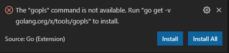

## 1. 下载

从官网[下载](https://golang.org/dl/)对应的操作系统版本

### 1.1 linux

linux 下需要手动安装，安装包下载完之后，在安装包目录下执行 shell 命令

```shell
sudo rm -rf /usr/local/go
sudo tar -C /usr/local -xzf go1.16.6.linux-amd64.tar.gz
```

然后修改 ~/.bashrc 文件，添加如下命令，以保证能够在全局查找到 go 命令

```shell
export PATH=$PATH:/usr/local/go/bin
```

最后如果运行 `go version` 能够正常输出 go 的版本，说明安装成功


## 2. 环境变量

配置环境变量

修改环境变量 `GOPATH` 可以修改依赖包下载的默认路径

打开命令行运行 go，如果提示命令找不到，则将 GO 可执行文件所在目录添加到 PATH 中。

```shell
go env -w GOPROXY=https://goproxy.cn,direct
go env -w GO111MODULE=on
```

运行以上命令切换 GO 包下载源到国内源。

## 3. VS Code 插件

在 VS Code 中搜素 [GO 插件](https://marketplace.visualstudio.com/items?itemName=golang.Go)，然后安装。


**图 3.1**

安装完之后，VS Code 会提示你需要安装工具：



**图 3.2**

这个时候，需要选择 `Install All` 这个按钮，会将 go 所需的所有命令行工具全部安装。

如果这个对话框不小心关闭了，也可以通过按F1键打开命令执行面板，


**图 3.2**

输入`Go:Install/Update Tools`，


**图 3.3**

全选进行安装。


**图 3.4**

不管用哪种方式触发安装命令行工具，都会弹出如下窗口：


**图 3.5**

> go 语言的代码格式校验（比如说缩进）和代码安全性校验（比如定义的变量未被使用）是分成两个工具进行操作的，前者使用 [golint](https://github.com/golang/lint)，后者默认是 [gofmt](https://golang.org/cmd/gofmt/)。vs code 对于不符合 golint 规则的情况，会选择做在代码下面标识红色或者黄色的波浪线，但是对于不符合格式化校验的情况，却不予理睬，这个跟其他语言的情况不一样，比如说 js 中使用 eslint 工具时里面的规则同时对代码格式和安全性校验做约束，不管哪条预定的规则不满足，都会有波浪线提示。


## 4. 调试 GO

创建一个文件夹，用 VS Code 打开，然后创建文件 main.go:

```go
package main

import "fmt"

func main() {
	fmt.Println("Hello, 世界")
}

```


`ctrl+shift+p` 输入 `Debug: Open launch.json` 打开 `launch.json` 文件，如果第一次打开,会新建一个配置文件，默认配置内容如下

```json
{
    "version": "0.2.0",
    "configurations": [
        {
            "name": "Launch",
            "type": "go",
            "request": "launch",
            "mode": "auto",
            "program": "${workspaceFolder}/main.go",
            "env": {},
            "args": []
        }
    ]
}
```


**图 4.1**

在第 6 行加断点，然后运行调试，会看到上图断点生效了。

> 新版本的 Go 默认需要设置为 module 才能被编译，否则在运行的时候会提示 module 找不到，解决的方案是在项目根目录运行 `go mod init gitlab.com/your_package_name`， 运行完成后会在当前项目根目录生成一个 go.mod，再次运行调试就不会出错。

如果你的项目的入口文件不在根目录，假设是在项目的 src 文件夹下，那么除了指定 `program` 属性外，还需要指定 `cwd` 属性：

```json
{
    // Use IntelliSense to learn about possible attributes.
    // Hover to view descriptions of existing attributes.
    // For more information, visit: https://go.microsoft.com/fwlink/?linkid=830387
    "version": "0.2.0",
    "configurations": [
        {
            "name": "Launch Package",
            "type": "go",
            "request": "launch",
            "mode": "auto",
            "cwd": "${workspaceFolder}/src/",
            "program": "${workspaceFolder}/src/main.go"
        }
    ]
}
```

